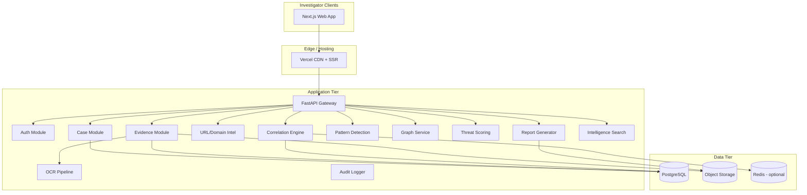
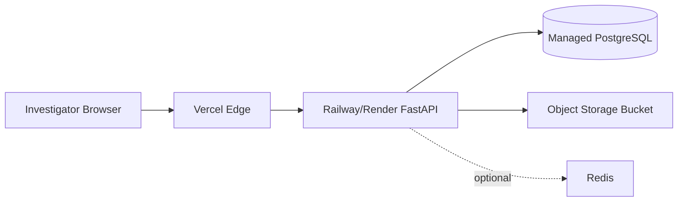
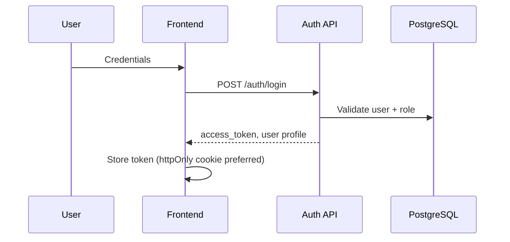
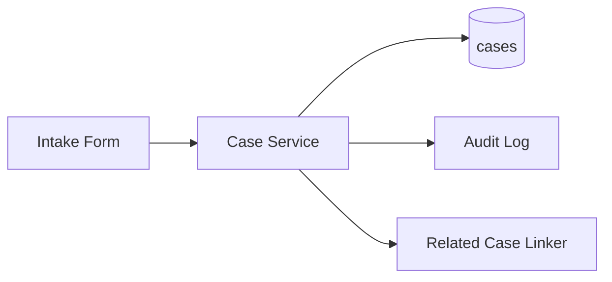
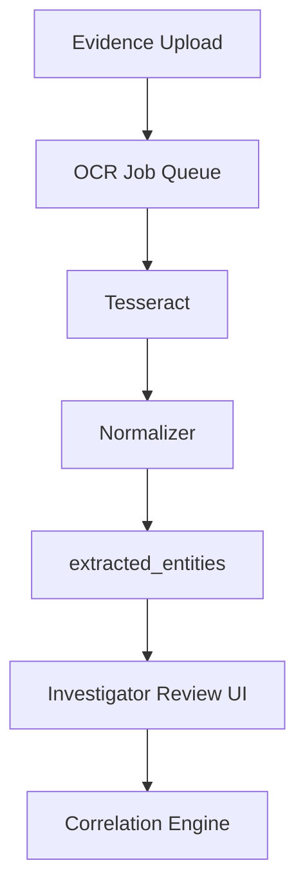
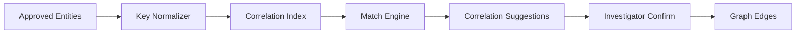
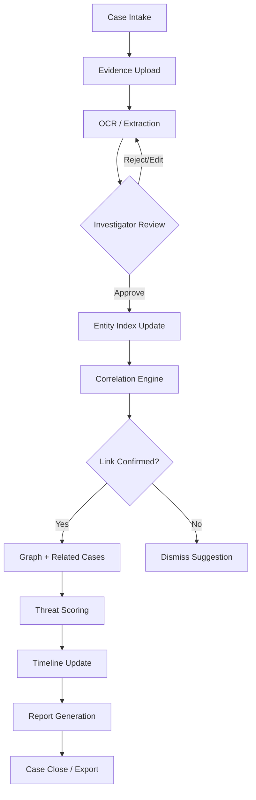
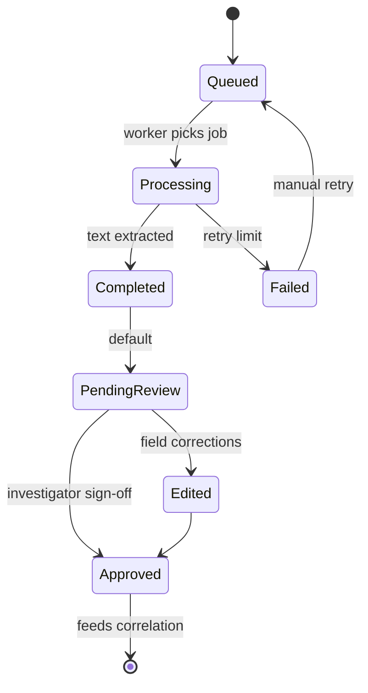
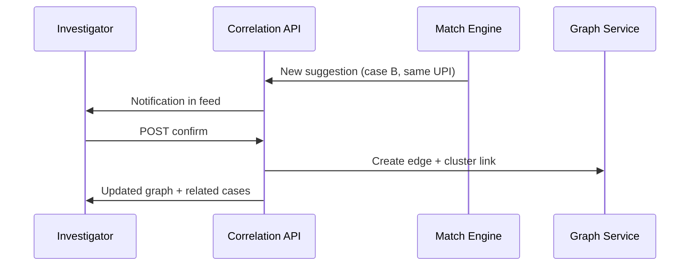

# KAVACH INTELLIGENCE — Architecture & Foundation Plan

**Product:** AI-Assisted Cybercrime Investigation & Intelligence Correlation Platform  
**Context:** Police cyber bureau hackathon → future government adoption  
**Status:** Planning only — **NO CODE YET**  
**Workspace:** Greenfield (empty repository as of planning date)

---

## Executive Summary

KAVACH INTELLIGENCE assists investigators by correlating fragmented digital evidence, surfacing repeated scam infrastructure, visualizing criminal relationships, and producing investigation-ready intelligence reports. The platform is **assistive**, not autonomous: investigators remain in control; AI/NLP supports extraction, suggestion, and pattern highlighting.

| Dimension | Decision |
|-----------|----------|
| Repo model | Monorepo (`apps/web`, `apps/api`, `packages/shared`) |
| Frontend | Next.js 14+ App Router, Tailwind, ShadCN, React Flow |
| Backend | FastAPI (Python), async where beneficial |
| Database | PostgreSQL (primary), object storage for evidence blobs |
| Deploy | Vercel (FE), Railway/Render (BE) |
| Auth | JWT + role-based access (investigator, supervisor, admin) |
| AI stance | OCR (Tesseract), optional embeddings (Sentence Transformers), rule + similarity correlation — no “detect all scammers” claims |

---

## PART A — STEP 1: Foundation Planning

### 1. Complete SDLC Planning

#### 1.1 Phases Overview

| Phase | Duration (Hackathon) | Duration (Gov Pilot) | Primary Outputs |
|-------|----------------------|----------------------|-----------------|
| Requirement Analysis | Days 1–2 | Weeks 1–3 | Personas, user stories, compliance matrix, MVP scope |
| System Design | Days 2–3 | Weeks 3–5 | Module boundaries, ERD, API contracts, workflow diagrams |
| Architecture | Days 3–4 | Weeks 4–6 | Deployment topology, security model, integration map |
| Development | Days 4–12 | Months 2–4 | MVP modules, CI, seed data, demo scenarios |
| Testing | Days 10–13 (parallel) | Ongoing | Unit, integration, UAT with investigators |
| Deployment | Day 13–14 | Week of go-live | Staging + prod, env secrets, runbooks |
| Scalability | Day 14 + backlog | Quarter 2+ | Caching, read replicas, queue workers |
| Maintenance | Post-hackathon | Continuous | Patch cadence, audit logs, model refresh policy |

#### 1.2 Requirement Analysis

**Stakeholders**

| Role | Goals | Constraints |
|------|-------|-------------|
| Cyber investigator | Faster case triage, evidence correlation, exportable reports | Chain of custody, no false certainty from AI |
| Supervisor | Case oversight, workload, quality of intelligence | Read-only on sensitive ops unless delegated |
| Admin | Users, roles, system config, audit | IT security policies |
| Bureau leadership | Demo credibility, adoption path | Budget, air-gapped options later |

**Functional requirements (MVP vs Later)**

| ID | Requirement | MVP | Later |
|----|-------------|-----|-------|
| FR-01 | Case CRUD with status workflow | ✓ | Advanced workflows |
| FR-02 | Evidence upload (images, PDFs, text) | ✓ | Video, email PST |
| FR-03 | OCR extraction with human review | ✓ | Multi-language |
| FR-04 | URL/domain normalization & intel | ✓ | WHOIS API integration |
| FR-05 | Correlation across cases (phones, URLs, UPI, names) | ✓ | Graph ML suggestions |
| FR-06 | Relationship graph visualization | ✓ | Timeline on graph |
| FR-07 | Threat/scam pattern scoring (explainable) | ✓ | Custom rule builder UI |
| FR-08 | Investigation report PDF | ✓ | Templates per crime type |
| FR-09 | Case timeline | ✓ | External system sync |
| FR-10 | Related case linking | ✓ | National index (policy) |
| FR-11 | Intelligence search | Basic | Full-text + semantic |
| FR-12 | Audit trail | ✓ | SIEM export |

**Non-functional requirements**

| Category | Target (Hackathon) | Target (Gov) |
|----------|-------------------|--------------|
| Availability | 99% demo window | 99.5%+ |
| Latency (dashboard) | < 2s P95 | < 1.5s P95 |
| Evidence upload | ≤ 25 MB/file MVP | Configurable quotas |
| Security | HTTPS, RBAC, hashed secrets | MFA, IP allowlist, encryption at rest |
| Compliance | Audit logs, data minimization | IT Act alignment, retention policy |
| Accessibility | WCAG 2.1 AA (core flows) | Full audit |

#### 1.3 System Design (Logical)



#### 1.4 Architecture (Physical / Deployment)



**Environment tiers:** `local` → `staging` → `production`  
**Secrets:** Database URL, JWT secret, storage credentials — never in client bundle.

#### 1.5 Development Strategy

| Sprint (Hackathon) | Focus |
|--------------------|-------|
| S1 | Monorepo scaffold, auth, case CRUD, DB migrations |
| S2 | Evidence upload, OCR pipeline, evidence viewer APIs |
| S3 | URL intel, correlation v1, graph API |
| S4 | Scoring, patterns, timeline, related cases |
| S5 | Report PDF, search, dashboard polish, demo data |

**Branching:** `main` (stable), `develop`, feature branches `feat/<module>-<ticket>`  
**API contract:** OpenAPI generated from FastAPI; shared types in `packages/shared` (optional TypeScript types hand-maintained for hackathon speed).

#### 1.6 Testing Strategy

| Layer | Scope | Tools |
|-------|-------|-------|
| Unit | Normalization, scoring rules, correlation keys | pytest, Vitest |
| Integration | API + DB, OCR job flow | pytest + testcontainers or docker-compose |
| E2E | Case intake → report | Playwright (critical paths only) |
| Security | AuthZ, IDOR on cases | Manual checklist + OWASP ZAP lite |
| UAT | Investigator script | 3 scripted scam scenarios |

#### 1.7 Deployment

| Component | Platform | Notes |
|-----------|----------|-------|
| Frontend | Vercel | `NEXT_PUBLIC_API_URL`, preview deployments per PR |
| Backend | Railway or Render | Dockerfile, health `/health` |
| DB | Railway Postgres / Supabase / Neon | Migrations via Alembic |
| Evidence files | S3-compatible (R2, MinIO local) | Pre-signed uploads |

**CI/CD (minimal):** GitHub Actions — lint, test, deploy staging on `develop`, manual promote to prod.

#### 1.8 Scalability Roadmap

| Stage | Trigger | Action |
|-------|---------|--------|
| 1 | > 50 concurrent users | Connection pooling (PgBouncer), API horizontal scale |
| 2 | Heavy OCR | Background worker queue (Celery/RQ + Redis) |
| 3 | Large graph queries | Materialized correlation table, pagination |
| 4 | Semantic search | pgvector or dedicated search service |
| 5 | Multi-tenant bureaus | `organization_id` on all tenant tables |

#### 1.9 Maintenance

- **Patch cycle:** Monthly security patches; dependency bot PRs weekly post-hackathon  
- **Data retention:** Configurable per bureau policy; soft-delete cases  
- **Model refresh:** Embedding model version pinned; re-index job documented  
- **Observability:** Structured logs (JSON), request ID, audit table for mutations  
- **Disaster recovery:** Daily DB backups; evidence bucket versioning  

---

### 2. Modular Architecture Planning

Each module follows: **Purpose → Boundaries → Dependencies → Integration → RA Summary → Features → Design Sketch → Data Flow → APIs → DB Entities → Security → Scalability**.

---

#### Module M0: Platform Core & Configuration

| Attribute | Detail |
|-----------|--------|
| **Purpose** | App bootstrap, env validation, shared middleware, health checks |
| **Boundaries** | No business logic; cross-cutting concerns only |
| **Dependencies** | None (root) |
| **Integration** | All modules register routes via FastAPI router includes |

**Requirement analysis:** Stable boot, CORS for Vercel origin, consistent error schema `{ code, message, details, request_id }`.

**Features:** Health/readiness, API versioning (`/api/v1`), request ID middleware, rate limit hook (future).

**Data flow:** Request → middleware chain → router → response.

**API touchpoints:** `GET /health`, `GET /ready`

**DB entities:** None

**Security:** CORS allowlist; security headers

**Scalability:** Stateless; scales with API replicas

---

#### Module M1: Identity & Access (Auth)

| Attribute | Detail |
|-----------|--------|
| **Purpose** | Login, JWT issuance, RBAC, session invalidation |
| **Boundaries** | Does not manage case content |
| **Dependencies** | M0 |
| **Integration** | All protected routes depend on `CurrentUser` dependency |

**RA summary:** Investigators must only see assigned/permitted cases; supervisors see team scope; admins manage users.

**Features:** Email/badge login (hackathon), password reset stub, roles: `investigator`, `supervisor`, `admin`, JWT refresh optional MVP.

**Design sketch:**



**API touchpoints (planned):**

| Method | Path | Description |
|--------|------|-------------|
| POST | `/api/v1/auth/login` | Authenticate |
| POST | `/api/v1/auth/logout` | Invalidate refresh (if used) |
| GET | `/api/v1/auth/me` | Current user profile |
| GET/POST/PATCH/DELETE | `/api/v1/admin/users` | Admin user CRUD |

**DB entities:** `users`, `roles`, `user_roles`, `sessions` (optional), `audit_log`

**Security:** bcrypt/argon2 passwords; short-lived JWT; role guards on every route

**Scalability:** Stateless JWT; external IdP (LDAP/OIDC) adapter interface later

---

#### Module M2: Case Management

| Attribute | Detail |
|-----------|--------|
| **Purpose** | Case lifecycle, metadata, assignment, status |
| **Boundaries** | Case record ≠ evidence processing (delegates to M3) |
| **Dependencies** | M1, M11 (audit) |
| **Integration** | Hub entity for correlation, graph, reports |

**RA summary:** FIR/cyber complaint reference, crime type tags (task scam, phishing, etc.), priority, assigned investigator.

**Features:** Create/update/archive case, status workflow (`intake` → `active` → `review` → `closed`), assignee, tags, related case links (FK), notes.

**Data flow:**



**API touchpoints:**

| Method | Path | Description |
|--------|------|-------------|
| GET | `/api/v1/cases` | List/filter cases |
| POST | `/api/v1/cases` | Create case |
| GET | `/api/v1/cases/{id}` | Case detail |
| PATCH | `/api/v1/cases/{id}` | Update metadata/status |
| GET | `/api/v1/cases/{id}/timeline` | Aggregated timeline events |
| POST | `/api/v1/cases/{id}/related` | Link related case |

**DB entities:** `cases`, `case_tags`, `case_assignments`, `case_notes`, `case_relations`, `case_status_history`

**Security:** Row-level scope by assignment + role; supervisor read team

**Scalability:** Indexed filters (`status`, `crime_type`, `created_at`); pagination cursor-based

---

#### Module M3: Evidence Management

| Attribute | Detail |
|-----------|--------|
| **Purpose** | Upload, store, version, chain-of-custody metadata |
| **Boundaries** | Storage only; extraction in M4 |
| **Dependencies** | M1, M2, M11 |
| **Integration** | Triggers OCR jobs; feeds correlation entities |

**Features:** Multi-file upload, MIME validation, checksum SHA-256, uploader + timestamp, evidence type (screenshot, chat, document, URL list).

**API touchpoints:**

| Method | Path | Description |
|--------|------|-------------|
| POST | `/api/v1/cases/{id}/evidence` | Upload / register |
| GET | `/api/v1/cases/{id}/evidence` | List evidence |
| GET | `/api/v1/evidence/{id}` | Metadata + download URL |
| DELETE | `/api/v1/evidence/{id}` | Soft delete (admin) |

**DB entities:** `evidence_items`, `evidence_versions`, `evidence_metadata`

**Security:** Pre-signed URLs; virus scan hook (future); no public bucket listing

**Scalability:** Direct-to-storage upload; async virus scan worker

---

#### Module M4: OCR & Extraction Pipeline

| Attribute | Detail |
|-----------|--------|
| **Purpose** | Extract text/entities from images & PDFs for investigator review |
| **Boundaries** | Assistive extraction — always `review_status: pending/approved` |
| **Dependencies** | M3, optional M9 (NLP) |
| **Integration** | Writes `extracted_entities`; notifies case timeline |

**Features:** Tesseract OCR, PDF page rasterization, structured fields (phone, UPI, URL, email regex), human approve/edit/reject.

**Data flow:**



**API touchpoints:**

| Method | Path | Description |
|--------|------|-------------|
| POST | `/api/v1/evidence/{id}/ocr` | Trigger OCR |
| GET | `/api/v1/evidence/{id}/extractions` | List extraction runs |
| PATCH | `/api/v1/extractions/{id}` | Approve/edit extracted fields |

**DB entities:** `ocr_jobs`, `ocr_results`, `extracted_entities`, `entity_review_log`

**Security:** OCR workers no public network egress except storage

**Scalability:** Background workers; job status polling or SSE

---

#### Module M5: URL & Domain Intelligence

| Attribute | Detail |
|-----------|--------|
| **Purpose** | Normalize, dedupe, enrich URLs/domains across cases |
| **Boundaries** | No live crawling MVP — enrichment stubs + manual flags |
| **Dependencies** | M4, M6 |
| **Integration** | Contributes nodes/edges to graph |

**Features:** URL canonicalization, domain extraction, registrar/hosting fields (manual/API later), blacklist tags, first/last seen.

**API touchpoints:**

| Method | Path | Description |
|--------|------|-------------|
| GET | `/api/v1/intel/domains` | Search domains |
| GET | `/api/v1/intel/domains/{id}` | Domain profile + linked cases |
| POST | `/api/v1/intel/domains/{id}/enrich` | Trigger enrichment job |

**DB entities:** `domains`, `urls`, `url_occurrences`, `domain_enrichment`

**Security:** SSRF-safe if fetch added later (allowlist, timeout)

**Scalability:** Unique indexes on `canonical_url`, `domain_name`

---

#### Module M6: Correlation Engine

| Attribute | Detail |
|-----------|--------|
| **Purpose** | Match entities across cases (phones, UPI IDs, emails, domains, names) |
| **Boundaries** | Suggests links; investigator confirms |
| **Dependencies** | M2, M4, M5, optional M9 |
| **Integration** | Feeds M7 graph, M8 scoring, M10 related cases |

**Features:** Exact + fuzzy match rules, confidence score with explainable factors, duplicate cluster ID, cross-case alert generation.

**Correlation keys (MVP):**

| Entity Type | Normalization |
|-------------|---------------|
| Phone | E.164, strip country code variants |
| UPI | Lowercase VPA |
| Email | Lowercase |
| URL/Domain | Canonical from M5 |
| Bank account | Digits only (if present) |

**Data flow:**



**API touchpoints:**

| Method | Path | Description |
|--------|------|-------------|
| GET | `/api/v1/cases/{id}/correlations` | Suggestions for case |
| POST | `/api/v1/correlations/{id}/confirm` | Confirm/reject link |
| GET | `/api/v1/intel/clusters` | Global duplicate clusters |

**DB entities:** `correlation_keys`, `correlation_matches`, `correlation_confirmations`, `entity_clusters`

**Security:** Cross-case visibility policy — only within bureau tenant

**Scalability:** Batch reindex job; materialized view `mv_entity_index`

---

#### Module M7: Relationship Graph Service

| Attribute | Detail |
|-----------|--------|
| **Purpose** | Serve graph JSON for React Flow (nodes/edges) |
| **Boundaries** | Visualization data — not a full graph DB MVP |
| **Dependencies** | M2, M5, M6 |
| **Integration** | Frontend React Flow consumes `GraphSnapshot` DTO |

**Features:** Node types (person, phone, domain, url, upi, case), edge types (`uses`, `mentioned_in`, `linked_to`, `same_cluster`), layout hints, filter by case or cluster.

**API touchpoints:**

| Method | Path | Description |
|--------|------|-------------|
| GET | `/api/v1/cases/{id}/graph` | Case-centric graph |
| GET | `/api/v1/clusters/{id}/graph` | Cluster-wide graph |
| GET | `/api/v1/graph/export` | JSON export |

**DB entities:** `graph_nodes`, `graph_edges` (or derive from confirmations + entities)

**Security:** Same case access rules; mask PII in exports per role

**Scalability:** Limit nodes (e.g. 500) with expand-on-demand; server-side pagination of edges

---

#### Module M8: Scam Pattern Detection & Threat Scoring

| Attribute | Detail |
|-----------|--------|
| **Purpose** | Rule-based pattern tags + explainable threat score |
| **Boundaries** | Advisory scores, not legal determinations |
| **Dependencies** | M4, M5, M6 |
| **Integration** | Dashboard widgets, report section |

**Pattern library (MVP examples):**

| Pattern ID | Signal |
|------------|--------|
| P-TASK-01 | Keywords: task, commission, telegram group |
| P-JOB-01 | Fake recruitment + payment for “training” |
| P-PHISH-01 | Domain age young + credential harvest path |
| P-UPI-01 | Multiple victims → same VPA |

**Scoring:** Weighted sum with caps; breakdown JSON `{ factors: [{ name, weight, evidence_refs }] }`

**API touchpoints:**

| Method | Path | Description |
|--------|------|-------------|
| GET | `/api/v1/cases/{id}/score` | Threat score + breakdown |
| GET | `/api/v1/patterns` | Pattern catalog |
| POST | `/api/v1/cases/{id}/recalculate` | Re-run scoring |

**DB entities:** `pattern_rules`, `case_pattern_hits`, `threat_scores`

**Security:** Transparent factors only; no black-box “guilty” flag

**Scalability:** Rules in DB; versioned rule sets

---

#### Module M9: NLP / Embeddings (Optional)

| Attribute | Detail |
|-----------|--------|
| **Purpose** | Semantic similarity for messages, near-duplicate scam scripts |
| **Boundaries** | Optional hackathon stretch; fallback to keyword rules |
| **Dependencies** | M4 |
| **Integration** | Enhances M6 and M12 search |

**Features:** Sentence Transformers embeddings stored in `embedding` column (pgvector later); similarity threshold suggestions.

**Scalability:** Batch embedding on approved text only; CPU worker sizing

---

#### Module M10: Investigation Report Generator

| Attribute | Detail |
|-----------|--------|
| **Purpose** | HTML → PDF investigation summary via WeasyPrint |
| **Boundaries** | Template rendering — data assembled from other modules |
| **Dependencies** | M2, M4, M6, M7, M8 |
| **Integration** | Download from FE; stored in object storage |

**Report sections:** Case summary, evidence index, extracted entities, correlations, graph snapshot (static image optional), threat score, timeline, analyst notes.

**API touchpoints:**

| Method | Path | Description |
|--------|------|-------------|
| POST | `/api/v1/cases/{id}/reports` | Generate report |
| GET | `/api/v1/reports/{id}` | Status + download URL |

**DB entities:** `reports`, `report_templates`

**Security:** Watermark “DRAFT” until supervisor approval (optional)

**Scalability:** Async PDF job for large cases

---

#### Module M11: Audit & Compliance Logger

| Attribute | Detail |
|-----------|--------|
| **Purpose** | Immutable audit trail for mutations and exports |
| **Dependencies** | M0 (middleware hooks) |
| **Integration** | Called from all write operations |

**DB entities:** `audit_events` (`actor_id`, `action`, `resource_type`, `resource_id`, `payload_hash`, `ip`, `timestamp`)

---

#### Module M12: Intelligence Search

| Attribute | Detail |
|-----------|--------|
| **Purpose** | Unified search across cases, entities, domains |
| **Dependencies** | M2, M5, M6 |
| **Integration** | Intelligence Feed UI |

**API touchpoints:** `GET /api/v1/search?q=&type=` with facets

**DB entities:** `search_documents` (denormalized) or Postgres full-text

---

#### Module M13: Investigator Dashboard (API aggregation)

| Attribute | Detail |
|-----------|--------|
| **Purpose** | BFF-style aggregates for dashboard cards |
| **Dependencies** | M2, M6, M8, M12 |
| **API:** `GET /api/v1/dashboard/summary` |

---

### 3. System Workflow Planning

#### 3.1 End-to-End Investigator Journey (Swimlane Narrative)

| Step | Investigator | System | Supervisor |
|------|--------------|--------|------------|
| 1 | Logs in | Auth validates role | — |
| 2 | Creates case (crime type, ref #) | Case record + audit | Notified if high priority |
| 3 | Uploads screenshots/chats/PDFs | Evidence stored, OCR queued | — |
| 4 | Reviews OCR extractions, fixes phones/URLs | Entities approved → correlation index updated | — |
| 5 | Views correlation suggestions | Match engine surfaces cross-case hits | — |
| 6 | Confirms valid links | Graph edges created | — |
| 7 | Opens relationship graph | Graph service renders cluster | — |
| 8 | Reviews threat score breakdown | Pattern engine explains factors | — |
| 9 | Checks intelligence feed/search | Global domain/VPA repeats | — |
| 10 | Generates PDF report | WeasyPrint job | Reviews draft |
| 11 | Closes case or escalates | Status → closed, retention policy | Approval optional |

#### 3.2 Core Workflow Diagram



#### 3.3 OCR Sub-Workflow



#### 3.4 Correlation Confirmation Workflow



---

### 4. Folder Structure Planning

**Recommendation:** Monorepo for hackathon velocity and shared contracts.

```
kavach-intelligence/
├── README.md
├── .github/
│   └── workflows/
│       ├── ci-api.yml
│       ├── ci-web.yml
│       └── deploy.yml
├── docs/
│   ├── ARCHITECTURE_PLAN.md
│   ├── FRONTEND_PLAN.md
│   ├── API_CONTRACTS.md          # future OpenAPI export
│   └── DEMO_SCENARIOS.md
├── apps/
│   ├── web/                      # Next.js
│   │   ├── app/                  # App Router pages
│   │   ├── components/
│   │   │   ├── ui/               # ShadCN
│   │   │   ├── layout/
│   │   │   ├── cases/
│   │   │   ├── evidence/
│   │   │   ├── graph/
│   │   │   └── intelligence/
│   │   ├── lib/
│   │   │   ├── api/              # API client wrappers
│   │   │   ├── auth/
│   │   │   └── hooks/
│   │   ├── styles/
│   │   ├── public/
│   │   ├── next.config.ts
│   │   ├── tailwind.config.ts
│   │   └── package.json
│   └── api/                      # FastAPI
│       ├── app/
│       │   ├── main.py
│       │   ├── core/             # config, security, deps
│       │   ├── modules/
│       │   │   ├── auth/
│       │   │   ├── cases/
│       │   │   ├── evidence/
│       │   │   ├── ocr/
│       │   │   ├── intel/
│       │   │   ├── correlation/
│       │   │   ├── graph/
│       │   │   ├── patterns/
│       │   │   ├── reports/
│       │   │   ├── search/
│       │   │   └── dashboard/
│       │   ├── models/           # SQLAlchemy
│       │   ├── schemas/          # Pydantic
│       │   └── services/
│       ├── alembic/
│       ├── tests/
│       ├── Dockerfile
│       ├── pyproject.toml
│       └── requirements.txt
├── packages/
│   └── shared/
│       ├── types/                # DTOs mirrored TS/Python
│       └── constants/
├── infra/
│   ├── docker-compose.yml        # local PG + MinIO + API
│   └── scripts/
│       └── seed_demo_data.py
├── .env.example
└── package.json                  # workspace root (optional turborepo)
```

**Environment variables (planned)**

| Variable | Location | Purpose |
|----------|----------|---------|
| `DATABASE_URL` | API | PostgreSQL |
| `JWT_SECRET` | API | Token signing |
| `STORAGE_BUCKET`, `STORAGE_KEY` | API | Evidence objects |
| `NEXT_PUBLIC_API_URL` | Web | API base URL |
| `CORS_ORIGINS` | API | Vercel domains |

**Service layer pattern (API):** `routers` → `services` → `repositories` → `models` (no DB in routers).

---

### 5. Architecture Review

#### 5.1 Scalability Assessment

| Area | Hackathon | Growth Path | Risk |
|------|-----------|-------------|------|
| API | Single instance | Horizontal + load balancer | Low |
| OCR | Sync MVP acceptable | Queue workers | Medium — plan queue early |
| DB | Single Postgres | Read replica, PgBouncer | Medium at 100k entities |
| Graph | Derived tables | Neo4j only if needed | Low if capped |
| Search | SQL LIKE/FTS | pgvector / OpenSearch | Low MVP |

#### 5.2 Maintainability

- **Modular monolith** first: clear `modules/` boundaries enable later extraction to microservices (OCR worker, report worker) without rewrite.
- **OpenAPI** as contract between FE/BE.
- **Migrations** versioned; no manual prod schema drift.

#### 5.3 Hackathon Feasibility

| Must-have (demo) | Cut if time low |
|------------------|-----------------|
| Auth + 1 role | Supervisor flows simplified |
| Case + evidence + OCR review | Multi-language OCR |
| Correlation v1 (exact match) | Semantic embeddings |
| Graph view (React Flow) | Graph layout auto-beautify |
| Threat score (3–5 rules) | Custom rule UI |
| PDF report (basic template) | Supervisor approval watermark |
| Seed demo: 3 linked cases | Live WHOIS |

**Credible demo narrative:** Three task-scam cases sharing UPI + domain → correlation alert → graph → report export.

#### 5.4 Integration Compatibility Checklist

| Module | FE Page | API Ready | DB Schema | Async Job |
|--------|---------|-----------|-----------|-----------|
| M1 Auth | Login | ✓ planned | ✓ | — |
| M2 Cases | Case list/detail | ✓ | ✓ | — |
| M3 Evidence | Upload/viewer | ✓ | ✓ | — |
| M4 OCR | Evidence viewer | ✓ | ✓ | ✓ OCR |
| M5 URL Intel | Intel feed | ✓ | ✓ | optional |
| M6 Correlation | Case detail | ✓ | ✓ | batch |
| M7 Graph | Graph view | ✓ | ✓ | — |
| M8 Scoring | Dashboard/case | ✓ | ✓ | — |
| M10 Report | Report UI | ✓ | ✓ | ✓ PDF |
| M12 Search | Intel search | ✓ | ✓ | — |

---

## Architecture Consistency Verification

| Check | Status |
|-------|--------|
| All 13 core features map to modules M1–M13 | ✓ |
| Case is central aggregate root | ✓ |
| AI/OCR always requires human review path | ✓ |
| Correlation suggestions require confirmation | ✓ |
| Scoring is explainable, not autonomous enforcement | ✓ |
| Audit spans mutations | ✓ |
| FE pages map 1:1 to API aggregates (see FRONTEND_PLAN.md) | ✓ |

## Scalability Confirmation

The design supports horizontal API scaling, async workers for OCR/PDF, indexed correlation, and optional pgvector — without requiring graph DB or microservices for MVP.

## Integration Compatibility (Future Modules)

Reserved extension points: external WHOIS, national fraud registry API, SIEM webhook export, SSO (OIDC), multi-tenant `organization_id`, mobile capture app via same REST API.

---

## Explicit Handoff Statement

Planning is complete and a static frontend prototype now exists in `frontend/` for landing, auth, dashboard, and cases-list flows.

Backend modules in this document (M0-M13) remain planned and are not implemented in this repository yet. Continue execution module-by-module from case intake/workspace and evidence pipelines onward.

### Recommended Implementation Order (Full Stack)

1. Monorepo scaffold + docker-compose (Postgres, MinIO)  
2. M1 Auth + M2 Cases (API + FE shell)  
3. M3 Evidence upload + M4 OCR review  
4. M5 URL normalization + M6 Correlation v1  
5. M7 Graph + M8 Scoring  
6. Case timeline + related cases (M2 extensions)  
7. M10 Report PDF + M12 Search + M13 Dashboard  
8. M11 Audit hardening + demo seed data  
9. UAT scripts + deployment pipelines  

---

*Document version: 1.0 | KAVACH INTELLIGENCE | Planning phase*
