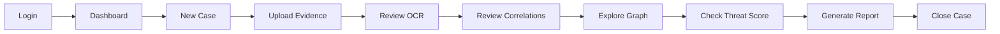
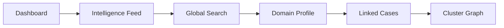
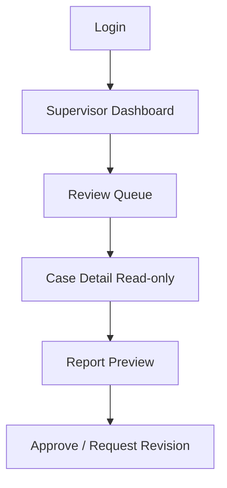
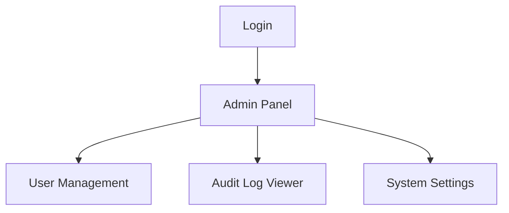

# KAVACH INTELLIGENCE — Frontend Architecture Plan

**Scope:** Frontend planning + static prototype progress tracker  
**Stack:** Next.js (App Router), Tailwind CSS, ShadCN UI, Framer Motion (minimal), React Flow  
**Companion doc:** `docs/ARCHITECTURE_PLAN.md`  
**Workspace:** Greenfield

---

## 1. Frontend Strategy Overview

### 1.1 Design Principles

| Principle | Application |
|-----------|-------------|
| Operational clarity | Dense but readable tables, filters, status chips — not decorative dashboards |
| Investigator-first | Primary actions ≤ 2 clicks from case context |
| Trust & transparency | AI/OCR outputs labeled “Suggested — requires review” |
| Government-grade aesthetic | Navy/slate neutrals, restrained accent, high contrast |
| Progressive disclosure | Advanced graph/search panels collapsible |
| API-ready | All data via typed API client; no mock logic in components long-term |

### 1.2 Personas & Frontend Surfaces

| Persona | Primary surfaces | Permissions (UI) |
|---------|------------------|------------------|
| Investigator | Dashboard, cases, evidence, graph, reports | CRUD own cases, confirm correlations |
| Supervisor | Team dashboard, case review, reports | Read team cases, comment, approve reports |
| Admin | Users, roles, audit, system settings | User management, read-only audit export |

---

## 2. User Flows

### 2.1 Investigator — Primary Flow



### 2.2 Investigator — Quick Intelligence Flow



### 2.3 Supervisor Flow



### 2.4 Admin Flow



---

## 3. Information Architecture

### 3.1 Sitemap

```
/                           Landing (public)
/login                      Authentication
/dashboard                  Investigator home
/cases                      Case list
/cases/new                  Case intake
/cases/[caseId]             Case workspace (tabbed)
/cases/[caseId]/evidence    Evidence (alias tab)
/cases/[caseId]/graph       Relationship graph
/cases/[caseId]/report      Report generation
/intelligence               Intelligence feed
/intelligence/search        Global search
/intelligence/domains/[id]  Domain profile
/supervisor                 Supervisor dashboard (role guard)
/admin                      Admin panel (role guard)
/settings                   User settings
```

### 3.2 Case Workspace Tabs (Sub-navigation)

| Tab | Route segment | Purpose |
|-----|---------------|---------|
| Overview | `/cases/[id]` | Summary, score, assignee, status |
| Evidence | `?tab=evidence` | Upload + viewer + OCR |
| Correlations | `?tab=correlations` | Suggestions + confirmations |
| Graph | `?tab=graph` | React Flow canvas |
| Timeline | `?tab=timeline` | Chronological events |
| Related | `?tab=related` | Linked cases |
| Report | `?tab=report` | Generate/download PDF |

---

## 4. Application Shell & Navigation

### 4.1 Dashboard Layout Structure

```
┌─────────────────────────────────────────────────────────────┐
│ Top Bar: Logo | Global Search | Notifications | User Menu   │
├──────────────┬──────────────────────────────────────────────┤
│ Side Nav     │ Main Content Area                             │
│ - Dashboard  │ Breadcrumbs + Page Title + Actions           │
│ - Cases      │                                               │
│ - Intel Feed │                                               │
│ - (role)     │                                               │
│ Supervisor   │                                               │
│ Admin        │                                               │
└──────────────┴──────────────────────────────────────────────┘
```

**Side nav behavior:** Collapsible on tablet; icon-only rail on mobile with drawer overlay.

### 4.2 Navigation Items by Role

| Nav Item | Investigator | Supervisor | Admin |
|----------|:------------:|:----------:|:-----:|
| Dashboard | ✓ | ✓ (team view) | ✓ |
| Cases | ✓ | ✓ (team) | ✓ (read) |
| Intelligence | ✓ | ✓ | ✓ |
| Supervisor | — | ✓ | ✓ |
| Admin | — | — | ✓ |
| Settings | ✓ | ✓ | ✓ |

---

## 5. Component Architecture

### 5.1 Atomic Design Mapping

| Layer | Examples | Location (planned) |
|-------|----------|-------------------|
| Atoms | `Button`, `Badge`, `Input`, `StatusChip`, `Icon` | `components/ui/*` (ShadCN) |
| Molecules | `SearchField`, `FileDropzone`, `EntityChip`, `ScoreFactorRow` | `components/molecules/*` |
| Organisms | `CaseTable`, `EvidenceGallery`, `CorrelationPanel`, `GraphCanvas` | `components/organisms/*` |
| Templates | `DashboardTemplate`, `CaseWorkspaceTemplate`, `AuthTemplate` | `components/templates/*` |
| Pages | Route files in `app/` composing templates | `app/**/page.tsx` |

### 5.2 Domain Component Groups

```
components/
├── ui/                 # ShadCN primitives
├── layout/
│   ├── AppShell.tsx
│   ├── SideNav.tsx
│   ├── TopBar.tsx
│   └── Breadcrumbs.tsx
├── cases/
│   ├── CaseTable.tsx
│   ├── CaseForm.tsx
│   ├── CaseHeader.tsx
│   └── CaseStatusSelect.tsx
├── evidence/
│   ├── EvidenceUploader.tsx
│   ├── EvidenceCard.tsx
│   ├── OcrReviewPanel.tsx
│   └── ExtractionFieldEditor.tsx
├── correlation/
│   ├── SuggestionList.tsx
│   └── ConfirmLinkDialog.tsx
├── graph/
│   ├── InvestigationGraph.tsx   # React Flow wrapper
│   ├── GraphNode.tsx
│   ├── GraphToolbar.tsx
│   └── GraphLegend.tsx
├── intelligence/
│   ├── IntelFeed.tsx
│   ├── DomainCard.tsx
│   └── SearchResults.tsx
├── reports/
│   ├── ReportBuilder.tsx
│   └── ReportHistory.tsx
├── dashboard/
│   ├── StatCards.tsx
│   ├── RecentCases.tsx
│   └── AlertsPanel.tsx
└── admin/
    ├── UserTable.tsx
    └── AuditLogTable.tsx
```

### 5.3 React Flow Integration (Graph View)

| Concern | Approach |
|---------|----------|
| Layout | `dagre` or built-in auto-layout — MVP: manual + fit-view |
| Node types | Custom nodes per entity type (color from design tokens) |
| Edge types | Styled by `linked_to`, `same_cluster`, etc. |
| Performance | Virtualize if > 200 nodes; server-side limit with “load more” |
| Export | PNG via `html-to-image` (stretch) or API static snapshot |
| State | Graph snapshot from API; local positions persisted optional `PATCH` |

---

## 6. Design System

### 6.1 Typography

| Token | Font | Usage |
|-------|------|-------|
| `--font-sans` | Inter or Source Sans 3 | UI, tables, forms |
| `--font-mono` | JetBrains Mono / IBM Plex Mono | IDs, hashes, URLs, logs |

| Scale | Size | Weight | Use |
|-------|------|--------|-----|
| `text-xs` | 12px | 400 | Metadata, timestamps |
| `text-sm` | 14px | 400–500 | Table cells, labels |
| `text-base` | 16px | 400 | Body |
| `text-lg` | 18px | 600 | Section headers |
| `text-xl` | 20px | 600 | Page titles |
| `text-2xl` | 24px | 700 | Dashboard hero metrics |

### 6.2 Spacing & Layout

- Base unit: **4px** (Tailwind default)
- Page padding: `p-6` desktop, `p-4` mobile
- Card padding: `p-4` / `p-6`
- Section gap: `gap-6`
- Max content width: `max-w-7xl` for tables; full width for graph

### 6.3 Color Palette (Government-Grade Operational)

**Not** hacker green-on-black. Professional, trustworthy, calm.

| Token | Hex | Usage |
|-------|-----|-------|
| `--color-primary` | `#1E3A5F` | Navy — primary buttons, headers |
| `--color-primary-hover` | `#2A4A73` | Hover states |
| `--color-accent` | `#0E7490` | Teal — links, active nav, focus rings |
| `--color-accent-muted` | `#67B8C7` | Charts, secondary highlights |
| `--color-background` | `#F8FAFC` | App background |
| `--color-surface` | `#FFFFFF` | Cards, panels |
| `--color-border` | `#E2E8F0` | Dividers, table borders |
| `--color-text` | `#0F172A` | Primary text |
| `--color-text-muted` | `#64748B` | Secondary text |
| `--color-success` | `#15803D` | Approved, confirmed |
| `--color-warning` | `#B45309` | Pending review, medium threat |
| `--color-danger` | `#B91C1C` | High threat, errors |
| `--color-info` | `#1D4ED8` | Informational badges |

**Threat score visualization:** Gradient from amber → orange → red for score bands; always show numeric score + factor list alongside color.

### 6.4 UI Consistency Rules

1. **Status chips** use shared enum → color map across cases, evidence, OCR jobs.
2. **Tables** — sticky header, row actions right-aligned, empty state with CTA.
3. **Forms** — labels above inputs; inline validation; destructive actions require dialog.
4. **AI-assisted blocks** — left border `accent` + badge “AI Suggested”.
5. **Loading** — skeleton for tables; spinner only for discrete actions.
6. **Motion** — Framer Motion for page transitions ≤ 200ms; respect `prefers-reduced-motion`.
7. **Icons** — Lucide via ShadCN; consistent 16/20px sizes.
8. **Dark mode** — optional Phase 2; design tokens structured to support.

### 6.5 Responsive Behavior

| Breakpoint | Behavior |
|------------|----------|
| `< md` | Side nav → drawer; tables → card list or horizontal scroll |
| `md–lg` | Collapsed side nav rail |
| `≥ lg` | Full layout; graph full viewport height `calc(100vh - header)` |
| Print | Report preview print stylesheet |

---

## 7. State Management Approach

### 7.1 Recommended Stack

| Concern | Solution |
|---------|----------|
| Server state | TanStack Query (React Query) — cache cases, evidence, graph |
| Auth session | Context + httpOnly cookie OR secure memory + refresh |
| URL state | `nuqs` or Next.js `searchParams` for filters, tabs |
| Graph local UI | Zustand slice (selection, panel open) — optional |
| Forms | React Hook Form + Zod validation |

### 7.2 Cache Keys (planned)

```
['cases', filters]
['case', caseId]
['case', caseId, 'evidence']
['case', caseId, 'correlations']
['case', caseId, 'graph']
['case', caseId, 'score']
['case', caseId, 'timeline']
['intel', 'feed']
['intel', 'domain', domainId]
['search', query]
['dashboard', 'summary']
```

### 7.3 Error & Empty States

- Global API error toast via ShadCN Sonner
- 403 → “Request access” message; 404 → case not found page
- Optimistic updates only for non-critical toggles (e.g. dismiss notification)

---

## 8. API Client Layer (Planned)

```
lib/api/
├── client.ts          # fetch wrapper, auth header, request ID
├── auth.ts
├── cases.ts
├── evidence.ts
├── ocr.ts
├── correlations.ts
├── graph.ts
├── intel.ts
├── reports.ts
├── search.ts
└── dashboard.ts
```

All pages depend on these modules — **no raw fetch in page components**.

---

## 9. Page Specifications

Each page: **Purpose → User flow → Components → Backend APIs → State → Scaling**.

---

### 9.1 Landing Page (`/`)

| Aspect | Detail |
|--------|--------|
| **Purpose** | Public product positioning for hackathon judges; CTA to login/demo |
| **User flow** | Visitor reads capability overview → clicks “Access Platform” → `/login` |
| **Components** | `HeroSection`, `CapabilityGrid`, `WorkflowDiagram`, `TrustStrip`, `Footer`, `CTAButton` |
| **Backend APIs** | None (static); optional `GET /health` for status badge |
| **State** | Static; optional analytics hook |
| **Scaling** | ISR static generation; CDN cached |

---

### 9.2 Authentication (`/login`)

| Aspect | Detail |
|--------|--------|
| **Purpose** | Secure bureau access; role resolved at login |
| **User flow** | Enter credentials → submit → redirect by role → `/dashboard` or `/supervisor` |
| **Components** | `AuthTemplate`, `LoginForm`, `PasswordField`, `RoleRedirect`, `ErrorAlert` |
| **Backend APIs** | `POST /api/v1/auth/login`, `GET /api/v1/auth/me` |
| **State** | Auth context populated; token in httpOnly cookie; `me` query cached |
| **Scaling** | SSO redirect route reserved (`/login/sso`); MFA step component slot |

---

### 9.3 Dashboard Layout (App Shell)

| Aspect | Detail |
|--------|--------|
| **Purpose** | Persistent chrome for authenticated app |
| **User flow** | All authenticated routes wrapped in shell |
| **Components** | `AppShell`, `SideNav`, `TopBar`, `GlobalSearch`, `NotificationBell`, `UserMenu` |
| **Backend APIs** | `GET /api/v1/auth/me`, `GET /api/v1/dashboard/summary` (prefetch) |
| **State** | Layout-level React Query; nav highlight from pathname |
| **Scaling** | Feature flags in nav; bureau branding slot in shell |

---

### 9.4 Investigator Dashboard (`/dashboard`)

| Aspect | Detail |
|--------|--------|
| **Purpose** | Operational snapshot — active cases, alerts, recent correlations |
| **User flow** | Login → dashboard → click stat/alert → deep link to case/tab |
| **Components** | `StatCards`, `AlertsPanel`, `RecentCases`, `ThreatSummaryChart`, `QuickActions` |
| **Backend APIs** | `GET /api/v1/dashboard/summary`, `GET /api/v1/cases?status=active&limit=5` |
| **State** | Parallel queries; refresh interval 60s optional |
| **Scaling** | Widget registry pattern — supervisor dashboard swaps widgets |

---

### 9.5 Case List & Case Upload (`/cases`, `/cases/new`)

| Aspect | Detail |
|--------|--------|
| **Purpose** | Browse/filter cases; intake new cybercrime case |
| **User flow (list)** | Filter by status/type → open case row |
| **User flow (new)** | Multi-step form: metadata → tags → assignee → create → redirect to evidence upload |
| **Components** | `CaseTable`, `CaseFilters`, `CaseForm`, `CrimeTypeSelect`, `TagInput`, `StepIndicator` |
| **Backend APIs** | `GET /api/v1/cases`, `POST /api/v1/cases`, `GET /api/v1/users?role=investigator` |
| **State** | URL-synced filters; form local until submit |
| **Scaling** | Virtualized table; saved filter presets |

**Case Upload Interface** is the `/cases/new` route — integrated into case management, not a separate product surface.

---

### 9.6 Case Workspace — Evidence Viewer (`/cases/[caseId]` evidence tab)

| Aspect | Detail |
|--------|--------|
| **Purpose** | Upload, preview, OCR review, approve extracted entities |
| **User flow** | Drop files → upload progress → select item → view image/PDF → side panel OCR fields → approve/edit |
| **Components** | `EvidenceUploader`, `EvidenceGallery`, `EvidencePreview`, `OcrReviewPanel`, `ExtractionFieldEditor`, `OcrJobStatusBadge` |
| **Backend APIs** | `GET/POST .../evidence`, `POST .../ocr`, `GET extractions`, `PATCH extractions/{id}` |
| **State** | React Query per evidence list; polling OCR job status; form state per extraction |
| **Scaling** | Chunked upload; thumbnail CDN URLs; lazy load PDF pages |

---

### 9.7 Intelligence Feed (`/intelligence`)

| Aspect | Detail |
|--------|--------|
| **Purpose** | Cross-case patterns — repeating domains, VPAs, new high-confidence clusters |
| **User flow** | Scan feed cards → filter by type → open domain/case link |
| **Components** | `IntelFeed`, `IntelCard`, `FeedFilters`, `ClusterPreview`, `DomainCard` |
| **Backend APIs** | `GET /api/v1/intel/feed`, `GET /api/v1/intel/clusters`, `GET /api/v1/intel/domains` |
| **State** | Infinite scroll pagination; filter in URL |
| **Scaling** | WebSocket for new alerts (future); digest mode |

---

### 9.8 Relationship Graph View (`/cases/[caseId]` graph tab or `/cases/[caseId]/graph`)

| Aspect | Detail |
|--------|--------|
| **Purpose** | Visualize entities and confirmed links for investigation insight |
| **User flow** | Open graph → filter node types → click node → inspector panel → jump to case/evidence |
| **Components** | `InvestigationGraph`, `GraphToolbar`, `GraphLegend`, `NodeInspectorPanel`, `GraphFilters` |
| **Backend APIs** | `GET /api/v1/cases/{id}/graph`, `GET /api/v1/clusters/{id}/graph` |
| **State** | React Flow controlled nodes/edges from API snapshot; Zustand for UI selection |
| **Scaling** | Subgraph loading; minimap; performance cap message |

---

### 9.9 Report Generation UI (`/cases/[caseId]` report tab)

| Aspect | Detail |
|--------|--------|
| **Purpose** | Configure and generate investigation-ready PDF |
| **User flow** | Select sections → add analyst notes → generate → poll status → download |
| **Components** | `ReportBuilder`, `SectionToggleList`, `AnalystNotesEditor`, `ReportHistory`, `DownloadButton`, `ReportPreviewIframe` (optional HTML preview) |
| **Backend APIs** | `POST /api/v1/cases/{id}/reports`, `GET /api/v1/reports/{id}` |
| **State** | Mutation + job polling; history list cached |
| **Scaling** | Template picker; supervisor approval status column |

---

### 9.10 Settings / Admin Panel (`/settings`, `/admin`, `/supervisor`)

| Aspect | Detail |
|--------|--------|
| **Purpose** | User preferences; admin user/audit management; supervisor review queue |
| **User flow (settings)** | Profile, password, notification prefs |
| **User flow (admin)** | User CRUD → audit log export |
| **User flow (supervisor)** | Queue → case → report approval |
| **Components** | `UserTable`, `UserFormDialog`, `AuditLogTable`, `SupervisorQueue`, `SystemSettingsForm` |
| **Backend APIs** | `/api/v1/admin/users`, `/api/v1/audit`, `/api/v1/supervisor/queue` |
| **State** | Role-guarded routes (middleware); admin tables paginated |
| **Scaling** | RBAC-driven tab visibility; CSV export |

---

### 9.11 Additional Pages (Supporting)

| Page | Purpose |
|------|---------|
| `/cases/[caseId]` overview | Case summary, threat score card, quick actions |
| `/cases/[caseId]` correlations tab | Suggestion list + confirm/dismiss |
| `/cases/[caseId]` timeline tab | Event stream from audit + system events |
| `/cases/[caseId]` related tab | Linked cases table |
| `/intelligence/search` | Global search results |
| `/intelligence/domains/[id]` | Domain profile + occurrences |
| `/404`, `/403` | Error boundaries |

---

## 10. Dashboard Structure (Investigator)

```
┌────────────────────────────────────────────────────────────┐
│  Welcome + Date                    [ + New Case ]          │
├─────────────┬─────────────┬─────────────┬──────────────────┤
│ Active Cases│ Pending OCR │ Correlation │ High Threat      │
│     12      │      5      │   Alerts 3  │   Cases 2      │
├─────────────┴─────────────┴─────────────┴──────────────────┤
│  Alerts Panel (priority)          │  Recent Cases Table    │
├───────────────────────────────────┴────────────────────────┤
│  Mini chart: Cases by crime type (last 30 days)            │
└────────────────────────────────────────────────────────────┘
```

---

## 11. Security & Accessibility (Frontend)

| Item | Implementation |
|------|----------------|
| Auth guard | Next.js middleware on `(app)` route group |
| Token storage | httpOnly cookie preferred over localStorage |
| XSS | Sanitize rich text in notes; CSP headers via Vercel config |
| CSRF | Same-site cookies + double-submit if needed |
| RBAC | Hide nav/actions; API still enforces |
| a11y | Focus rings, aria labels on graph nodes, keyboard nav for tables |
| PII | Mask phone/UPI in lists; reveal on click with audit (future) |

---

## 12. Future Scalability (Frontend)

| Area | Path |
|------|------|
| i18n | `next-intl` — Hindi/English for labels |
| Micro-frontends | Not needed; feature modules in monorepo |
| Real-time | SSE/WebSocket channel for OCR done / new correlation |
| Mobile | Responsive web MVP; React Native reuse API client |
| Theming per bureau | CSS variables from config endpoint |
| Plugin widgets | Dashboard widget registry typed interface |

---

## 13. Implementation Order (Frontend Modules)

Recommended build sequence for Step 3:

| Order | Module | Routes |
|-------|--------|--------|
| 1 | Design tokens + ShadCN + App shell | layout, nav |
| 2 | Auth + middleware | `/login` |
| 3 | Dashboard | `/dashboard` |
| 4 | Case list + intake | `/cases`, `/cases/new` |
| 5 | Case workspace shell + overview tab | `/cases/[id]` |
| 6 | Evidence upload + OCR review | evidence tab |
| 7 | Correlations tab | correlations tab |
| 8 | Graph view (React Flow) | graph tab |
| 9 | Timeline + related cases | tabs |
| 10 | Intelligence feed + search | `/intelligence` |
| 11 | Report UI | report tab |
| 12 | Supervisor + admin | `/supervisor`, `/admin` |
| 13 | Landing page polish | `/` |

---

## 13.1 Prototype Progress Tracker (Static HTML/JS)

Current implementation in `frontend/`:

| Module | Status | Implemented in prototype |
|--------|--------|--------------------------|
| 1. App shell + design tokens | Completed | Shared CSS tokens/components, app shell layout |
| 2. Auth | Completed | `login.html` + `js/auth.js` demo session guard |
| 3. Dashboard | Completed | `dashboard.html` + stats/recent cases/alerts |
| 4. Cases list + intake | Completed | `cases.html` with gated intake form, evidence at intake |
| 5. Case workspace shell | Completed | `case-workspace.html` tabbed workspace |
| 6. Evidence + OCR review | Completed (mock) | Upload/list evidence, OCR approval inputs, local persistence |
| 7. Correlations | Completed (mock) | Suggestion cards + confirm/dismiss + timeline/graph updates |
| 8. Graph view | Completed (mock) | SVG entity graph panel with live cluster label updates |
| 9. Timeline + related | Completed (mock) | Case timeline + related case list |
| 10. Intelligence feed + search | Completed (mock) | `intelligence.html` and `intelligence-search.html` with filters and search logic |
| 11. Report UI | Completed (mock) | Generate/download text report + local report history |
| 12. Supervisor + admin | Completed (mock) | `supervisor.html` review queue and `admin.html` roster + logs |
| 13. Landing polish | Completed | Full landing page sections and responsiveness |

Notes:
- Mock flows use browser storage keys (`kavach_*`) and are intentionally backend-agnostic.
- Production API integration remains per planned endpoints in this document and `ARCHITECTURE_PLAN.md`.

---

## 14. Architecture Consistency Verification (Frontend)

| Check | Status |
|-------|--------|
| Every ARCHITECTURE_PLAN module has FE touchpoints | ✓ |
| Graph consumes `GraphSnapshot` API only | ✓ |
| OCR review before correlation display emphasized | ✓ |
| No autonomous “scammer detected” UI copy | ✓ |
| Role-based nav matches M1 RBAC | ✓ |
| Operational color palette defined | ✓ |

## 15. Scalability Confirmation (Frontend)

Server-state via React Query supports pagination, prefetching, and parallel routes. Component boundaries align with backend modules for team parallelization. React Flow isolated in `components/graph` for performance tuning without touching case forms.

## 16. Integration Compatibility

| Future module | FE hook |
|---------------|---------|
| WHOIS enrichment | Domain profile “Enrich” button → job poll |
| Semantic search | Search page “semantic mode” toggle |
| SSO | Login page provider button |
| SIEM | Admin export CSV |
| Multi-tenant | Logo/name from `GET /config` |

---

## Explicit Handoff Statement

Static frontend prototype is now available in `frontend/` with modules 1-9, 11, and 13 implemented as static/mock flows.

Next implementation should prioritize:
1. Intelligence feed + search (`/intelligence`, `/intelligence/search`)
2. Supervisor/admin role pages
3. Backend API integration replacement for current localStorage mocks

---

*Document version: 1.0 | KAVACH INTELLIGENCE | Frontend planning phase*
